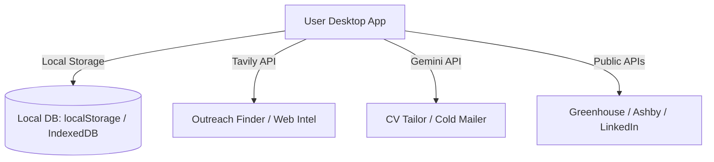

# 🌌 CareerOS

<p align="center">
  
</p>

<h3 align="center">The Local-First, Zero-Tracker Job Application Workspace</h3>

<p align="center">
  <a href="https://github.com/itsyashvardhan/CareerOS/actions"></a>
  <a href="https://tauri.app/"></a>
  <a href="https://github.com/itsyashvardhan/CareerOS/releases/latest"></a>
  <a href="https://github.com/itsyashvardhan/CareerOS/blob/main/LICENSE"></a>
</p>

---

**CareerOS** is a ultra-lightweight, single-file desktop job application suite built specifically for freshers and early-career developers applying to AI/SaaS companies in India, Singapore, and Southeast Asia. 

Rather than relying on noisy, bloated web portals, CareerOS operates entirely on your local machine. It combines a guest job boards scanner, real-time referral finder, interactive network graph, and LLM-powered resume/outreach writers in a single, local-first workspace.

---

## ⚡ Key Modules



### 📋 1. The CV Engine
*   **Context-Aware Audit**: Paste your base resume and a job description to instantly benchmark your skills, highlight missing keywords, and identify potential resume screening blockers.
*   **Bullet Rewriter**: Re-write specific CV bullets using the Gemini API to emphasize achievements, action-oriented metrics, and exact keywords.
*   **Zero Logs**: Your resume text never leaves your memory space; everything is kept locally in your browser's private store.

### 🔍 2. The Outreach Finder & Strategizer
*   **Regional Search**: Locate hiring managers, team leads, or developers at a target company filtered by desired country/region.
*   **Tailored strategizing**: Draft short, punchy (under 100 words), high-conversion cold emails or LinkedIn InMails tailored with a custom hook based on your CV and the target job description.
*   **Follow-Up Sequences**: Generate Day 5 and Day 14 follow-up sequences in one click and save them directly to your application logs.

### 📊 3. The Tracker Board
*   **Status Pipeline**: Track application states (To Apply, Applied, Interview, Offer, Rejected) on a visual board.
*   **Auto-Tracking**: Instantly bookmark contacts, jobs, and follow-up reminders.
*   **Local Backups**: Automatic mirror backup of your board to IndexedDB to survive browser cache sweeps.

### 🕸️ 4. The Interactive Referral Network
*   **D3.js Visualization**: A force-directed connection graph showing your bookmarked targets grouped by company.
*   **One-Click Outreach**: Click on any employee node on your network graph to immediately load their contact profile, configure outreach goals, and draft cold messages.

### 📡 5. Direct Job Board Scanner
*   **Aggregated Scraping**: Directly scrapes Greenhouse, AshbyHQ, and LinkedIn guest APIs from your client thread (no middleman proxy required).
*   **Entry-Level Filters**: Configured to strip senior, lead, principal, and manager roles, showing only fresh entry-level listings.
*   **In-App Alerts**: Optional in-app notifications and toast alerts when new matching jobs are discovered on the scraper timeline.

---

## 🔒 Privacy & Architecture

CareerOS is built to guarantee absolute privacy. In a world of recruiters tracking your clicks, CareerOS stores everything on your disk.

*   **No Accounts / Databases**: Your target roles, applications, resume drafts, and contacts are saved in your local browser storage (`localStorage` & `IndexedDB`).
*   **No Analytics**: Zero analytics, trackers, telemetry, or third-party tracking scripts.
*   **Direct API Calls**: When analyzing resumes or searching for contacts, the app communicates directly with official API endpoints (Google AI Studio and Tavily). No middleware is used.
*   **Auto-Updater**: The Tauri wrapper includes signature verification for secure updates directly from GitHub.

---

## 🛠️ Setup & Run

### Running Web Client (No Install / Dev Server)
Since the entire frontend is encapsulated in a single, standard-compliant HTML/JS page, you can run the app without any build steps:
1. Clone the repository.
2. Open app/index.html directly in any modern browser.

### Running Desktop App (Development)
To run the Tauri-packaged desktop app locally:
```bash
# Clone the repository
git clone https://github.com/itsyashvardhan/CareerOS.git
cd CareerOS/src-tauri

# Run in Cargo development mode
cargo tauri dev
```

### Setup Keys (In-App)
Click on the **Settings** icon on the top right and add your API keys:
1. **Gemini API Key**: Get a free key at [Google AI Studio](https://aistudio.google.com/). Used for resume audits, rewriters, and outreach generation.
2. **Tavily API Key**: Get a free key at [Tavily Search](https://app.tavily.com/). Used for hiring manager discovery and web intelligence.

---

## 🚀 Releasing & Shipping Updates

The desktop application is packaged using **Tauri v2** with a Windows-only GitHub Actions release workflow.

To publish a release:
1. Update the app version in `src-tauri/tauri.conf.json` and `src-tauri/Cargo.toml`.
2. Commit changes and push to `main`.
3. Tag the version (e.g., `v1.0.7`) and push:
   ```bash
   git tag v1.0.7
   git push origin v1.0.7
   ```
4. GitHub Actions builds the NSIS `.exe` installer, signs it using the Minisign private key, generates the `latest.json` auto-updater signature metadata, and publishes it to GitHub Releases.
5. Desktop clients automatically poll the release endpoint on startup and prompt the user to update.

---

## 📄 License

CareerOS is distributed under the MIT License. See LICENSE for more details.
